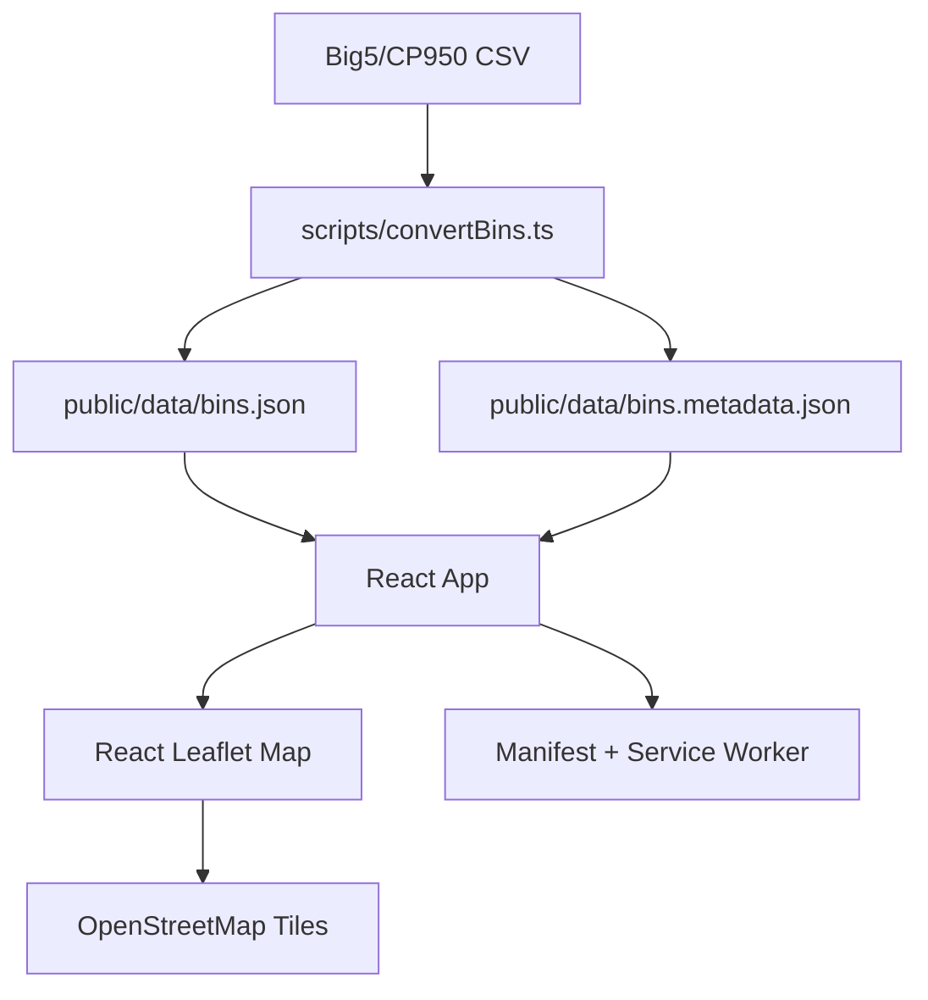

# System Design Deep Dive

## Product Goal

Taipei Pedestrian Garbage Bin Map is a public, mobile-first web app for finding pedestrian-use public garbage bins in Taipei. It is intentionally static: no backend, no accounts, no admin surface, and no paid map API.

## Architecture

## Runtime Flow

1. Vite serves the React app as static assets.
2. `App.tsx` fetches local bin JSON and metadata from `/data/`.
3. Search and district filters run in memory.
4. Nearby lookup asks for browser geolocation, calculates Haversine distances locally, then shows the nearest 10 bins.
5. The map is lazy-loaded as a separate chunk so the initial UI can paint faster.
6. The service worker caches static assets and data for repeat visits.

## Main Boundaries

- `scripts/convertBins.ts`: source data normalization and metadata generation.
- `src/utils/binUtils.ts`: pure filtering, distance, and formatting logic.
- `src/App.tsx`: state orchestration and browser API coordination.
- `src/components/`: reusable UI and map/list components.
- `tests/e2e/`: browser-level user-flow coverage.

## Verification Strategy

- Unit tests cover pure utility behavior.
- Playwright e2e tests cover public user journeys on desktop and mobile Chromium.
- `./init.sh` is the baseline command for agents and release checks.
- Lighthouse was used to verify publish-readiness targets.

## Scaling Notes

The current dataset is small enough for client-side filtering and map rendering. If the dataset grows by an order of magnitude, the next likely bottlenecks are marker rendering and list virtualization.
