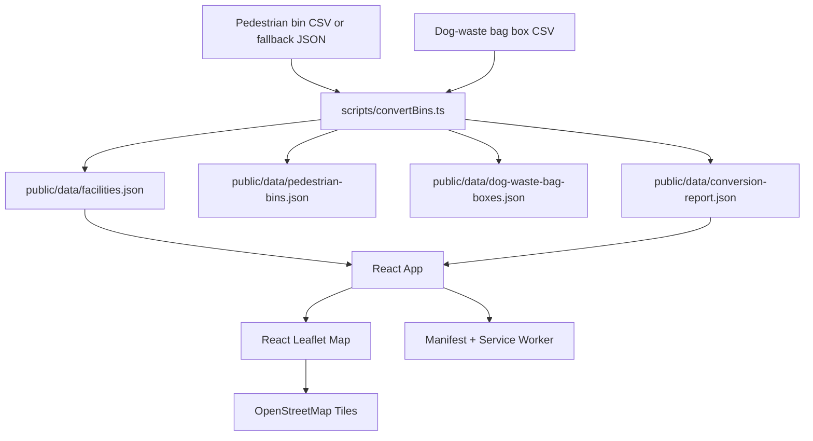

# System Design Deep Dive

## Product Goal

Taipei Street Cleanliness Map is a public, mobile-first web app for finding pedestrian garbage bins and dog-waste bag boxes in Taipei. It stays static by design: no backend, accounts, admin surface, database, or paid map API.

## Architecture

## Data Model

The frontend uses a generic `Facility` record with `type: 'pedestrian_bin' | 'dog_waste_bag_box'`. Dog-waste bag boxes keep `road` and `location` fields in addition to a display `address`; pedestrian bins use the original `address`.

The converter applies broad Taipei coordinate bounds. Out-of-bounds coordinates are preserved with `isCoordinateOutlier: true` and are recorded in `conversion-report.json`.

## Runtime Flow

1. Vite serves the React app as static assets.
2. `App.tsx` fetches `/data/facilities.json` and `/data/conversion-report.json`.
3. Search, district, and facility-type filters run in memory.
4. Nearby lookup asks for browser geolocation, calculates Haversine distances locally, and shows the nearest 10 facilities from the active filter set.
5. The map is lazy-loaded as a separate chunk so the initial UI can paint faster.
6. The service worker caches static assets and local JSON for repeat visits.

## Main Boundaries

- `scripts/convertBins.ts`: CP950 CSV decoding, facility normalization, outlier reporting.
- `src/utils/facilityUtils.ts`: pure filtering, distance, labels, map-link, and coordinate-bound logic.
- `src/App.tsx`: state orchestration, data loading, geolocation coordination.
- `src/components/`: reusable controls, map, popup, legend, notice, and list UI.
- `tests/e2e/`: browser-level user-flow coverage.

## Verification Strategy

- Unit tests cover pure utility behavior.
- Playwright e2e tests cover public user journeys, language persistence, facility filters, search, geolocation success, and geolocation denial.
- `./init.sh` is the baseline command for agents and release checks.

## Scaling Notes

The combined dataset is about 1,700 records, so local filtering and Leaflet canvas markers are sufficient. If the dataset grows substantially, the next likely upgrade is marker clustering or list virtualization.
