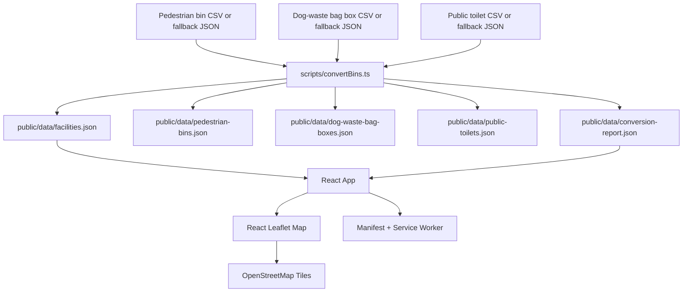

# System Design Deep Dive

## Product Goal

Taipei Public Amenities Map is a public, mobile-first static web app for finding public toilets, pedestrian garbage bins, and dog-waste bag boxes in Taipei. It has no backend, accounts, admin surface, database, or paid map API.

## Architecture

## Data Model

The frontend uses one generic `Facility` record with `type: 'pedestrian_bin' | 'dog_waste_bag_box' | 'public_toilet'`. Public toilets add optional fields for name, category, manager, total seats, grade counts, accessible seats, and parent-child seats.

The converter trims CSV headers, decodes Big5/CP950 for the bin datasets, and reads UTF-8-SIG for public toilets. It preserves broad Taipei coordinate outliers with `isCoordinateOutlier: true`; invalid numeric coordinates are dropped and listed in `invalidCoordinateRows`.

## Runtime Flow

1. Vite serves the React app as static assets.
2. `App.tsx` fetches `/data/facilities.json` and `/data/conversion-report.json`.
3. Search, district, facility type, public toilet category, and public toilet accessibility filters run in memory.
4. Nearby lookup asks for browser geolocation, calculates Haversine distances locally, and shows the nearest 10 facilities from the active filter set.
5. The map is lazy-loaded as a separate chunk.
6. Large unfiltered result sets do not render thousands of markers; users narrow via filters or nearby lookup before markers appear.
7. The service worker caches static assets and local JSON for repeat visits.

## Main Boundaries

- `scripts/convertBins.ts`: source decoding, facility normalization, fallback handling, and conversion reporting.
- `src/utils/facilityUtils.ts`: filtering, distance, labels, map links, and coordinate bounds.
- `src/App.tsx`: state orchestration, data loading, filters, geolocation coordination.
- `src/components/`: reusable controls, map, popup, legend, notice, and list UI.
- `tests/e2e/`: browser-level user-flow coverage.

## Verification Strategy

- Unit tests cover pure utility behavior.
- Playwright e2e tests cover all three facility types, language persistence, toilet filters, search, geolocation success, geolocation denial, and marker-cap behavior.
- `./init.sh` is the baseline command for agents and release checks.

## Scaling Notes

The combined dataset is 3,256 records. Marker rendering is capped for large result sets to avoid mobile map clutter without adding a clustering dependency. Marker clustering remains the next upgrade if the product needs all markers visible at low zoom.
