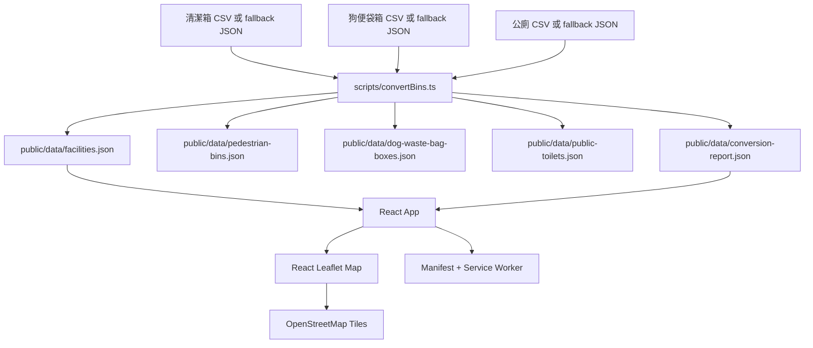

# 系統設計 Deep Dive

## 產品目標

台北市公共便利設施地圖是公開、mobile-first 的靜態 web app，用來查找台北市公廁、行人專用清潔箱與狗便袋箱。架構刻意保持單純：沒有後端、帳號、admin 頁、資料庫或付費地圖 API。

## 架構

## 資料模型

前端使用通用 `Facility` record，`type` 可為 `pedestrian_bin`、`dog_waste_bag_box` 或 `public_toilet`。公廁額外保留名稱、類別、管理單位、座數、評等等級數量、無障礙廁座數與親子廁座數。

轉換腳本會 trim CSV 欄名，清潔箱與狗便袋箱使用 Big5/CP950 解碼，公廁使用 UTF-8-SIG。超出台北市寬鬆 bounding box 的座標會保留並加上 `isCoordinateOutlier: true`；無效數字座標列會刪除並記錄在 `invalidCoordinateRows`。

## Runtime Flow

1. Vite 以靜態資源方式提供 React app。
2. `App.tsx` 讀取 `/data/facilities.json` 與 `/data/conversion-report.json`。
3. 搜尋、行政區、設施類型、公廁類別與公廁設備篩選都在瀏覽器記憶體內完成。
4. 附近設施功能透過瀏覽器 geolocation 取得位置，用 Haversine 公式計算距離，並從目前篩選集合中列出最近 10 筆。
5. 地圖元件使用 lazy-loaded chunk。
6. 大量未篩選結果不會直接渲染數千個 markers；使用者需透過篩選或附近功能縮小範圍後顯示 markers。
7. Service worker 快取靜態資源與本機 JSON，支援重複造訪。

## 主要邊界

- `scripts/convertBins.ts`：來源解碼、設施資料標準化、fallback 處理與轉換報告。
- `src/utils/facilityUtils.ts`：篩選、距離、標籤、Google Maps 連結與座標範圍。
- `src/App.tsx`：狀態協調、資料載入、篩選與 geolocation 協調。
- `src/components/`：控制列、地圖、popup、圖例、提醒與列表 UI。
- `tests/e2e/`：瀏覽器層級的使用者流程測試。

## 驗證策略

- Unit tests 覆蓋純工具函式。
- Playwright e2e 覆蓋三種設施類型、語言保存、公廁篩選、搜尋、定位成功、定位失敗與 marker cap 行為。
- `./init.sh` 是 agent 與 release check 的基準指令。

## 擴充備註

目前合併資料為 3,256 筆。為避免手機地圖過度擁擠，大量結果會限制 marker 渲染，且不新增 clustering dependency。若產品需要在低 zoom 顯示所有 markers，下一步再加入 marker clustering。
