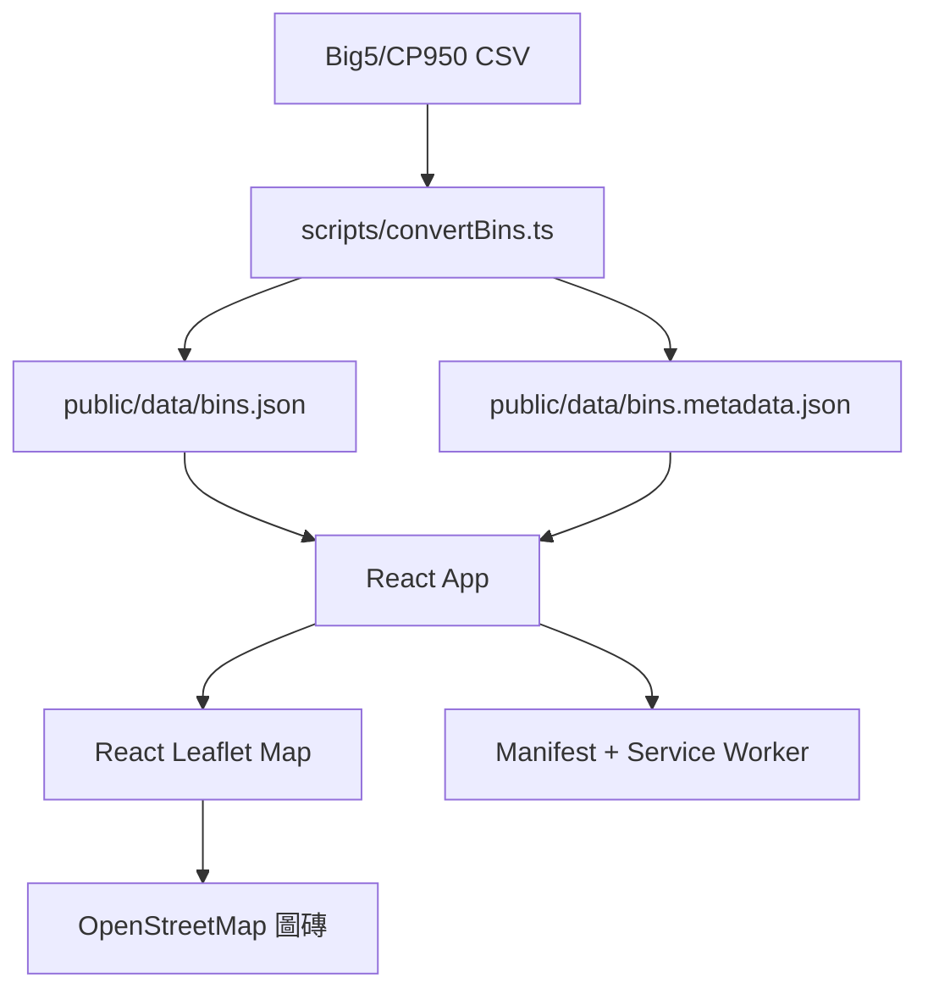

# 系統設計深度說明

## 產品目標

台北市行人專用清潔箱地圖是一個公開、手機優先的 Web App，用來查找台北市行人專用公共清潔箱。此專案刻意保持靜態化：沒有後端、沒有帳號、沒有管理介面，也不需要付費地圖 API。

## 架構

## 執行流程

1. Vite 將 React app 作為靜態資源提供。
2. `App.tsx` 從 `/data/` 載入本機清潔箱 JSON 與 metadata。
3. 搜尋與行政區篩選都在瀏覽器記憶體中完成。
4. 附近清潔箱功能會要求瀏覽器定位權限，在本機用 Haversine 公式計算距離，再顯示最近 10 筆。
5. 地圖以 lazy-loaded chunk 載入，讓初始 UI 更快顯示。
6. Service worker 會快取靜態資源與資料，支援重複造訪與網路不穩情境。

## 主要邊界

- `scripts/convertBins.ts`：來源資料清理與 metadata 產生。
- `src/utils/binUtils.ts`：純函式的篩選、距離與格式化邏輯。
- `src/App.tsx`：狀態協調與瀏覽器 API 整合。
- `src/components/`：可重用 UI、地圖與列表元件。
- `tests/e2e/`：瀏覽器層級的使用者流程測試。

## 驗證策略

- Unit tests 覆蓋純工具函式。
- Playwright e2e tests 覆蓋桌機與手機 Chromium 的公開使用者流程。
- `./init.sh` 是 agent 與 release check 的基準命令。
- Lighthouse 用來驗證上線前的 performance、accessibility、best practices 與 SEO 目標。

## 擴充注意事項

目前資料量足以在前端完成篩選與地圖呈現。如果資料量增加一個數量級，下一個可能瓶頸會是 marker rendering 與列表虛擬化。
