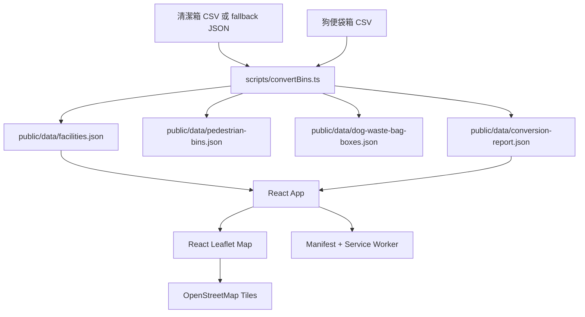

# 系統設計 Deep Dive

## 產品目標

台北市街頭清潔便利地圖是公開、mobile-first 的靜態 web app，用來查找台北市行人專用清潔箱與狗便袋箱。架構刻意保持單純：沒有後端、帳號、admin 頁、資料庫或付費地圖 API。

## 架構

## 資料模型

前端使用通用 `Facility` record，`type` 可為 `pedestrian_bin` 或 `dog_waste_bag_box`。狗便袋箱保留 `road` 與 `location`，並產生可顯示的 `address`；行人專用清潔箱則使用原始 `address`。

轉換腳本使用寬鬆的台北市座標 bounding box。超出範圍的座標不會被刪除，而是保留並加上 `isCoordinateOutlier: true`，同時記錄在 `conversion-report.json`。

## Runtime Flow

1. Vite 以靜態資源方式提供 React app。
2. `App.tsx` 讀取 `/data/facilities.json` 與 `/data/conversion-report.json`。
3. 搜尋、行政區與設施類型篩選都在瀏覽器記憶體內完成。
4. 附近設施功能透過瀏覽器 geolocation 取得位置，用 Haversine 公式計算距離，並從目前篩選集合中列出最近 10 筆。
5. 地圖元件使用 lazy-loaded chunk，讓初始 UI 更快顯示。
6. Service worker 快取靜態資源與本機 JSON，支援重複造訪。

## 主要邊界

- `scripts/convertBins.ts`：CP950 CSV 解碼、設施資料標準化、座標異常報告。
- `src/utils/facilityUtils.ts`：純函式，處理篩選、距離、標籤、Google Maps 連結與座標範圍。
- `src/App.tsx`：狀態協調、資料載入、geolocation 協調。
- `src/components/`：控制列、地圖、popup、圖例、提醒與列表 UI。
- `tests/e2e/`：瀏覽器層級的使用者流程測試。

## 驗證策略

- Unit tests 覆蓋純工具函式。
- Playwright e2e 覆蓋公開流程、語言保存、設施篩選、搜尋、定位成功與定位失敗。
- `./init.sh` 是 agent 與 release check 的基準指令。

## 擴充備註

目前合併資料約 1,700 筆，因此本機篩選與 Leaflet canvas markers 足夠。若資料量大幅成長，下一個可能升級點是 marker clustering 或列表虛擬化。
